# Índice

- [Aula 1 - Programação em Arduino e Eletrônica Básica](#1)
  - [Autoestudos](#1-autoestudo)
    - Instalação de ambiente
    - Arduino em 100 segundos (pulado)
    - Como utilizar um multímetro
    - Componentes eletrônicos
    - Pode resistor negativo no LED?
    - Como usar a Protoboard
    - Tinkercad (pulado)
    - Fundamentos de C++ e
    - Projeto Pisca LED
    <br>
  - [Instrução](#1-instrucao)

  - [Ponderada](#1-ponderada)

---

## <a name="1"></a> Aula 1 - Programação em Arduino e Eletrônica Básica

### <a name="1-autoestudo"></a> Aula 1 - Programação em Arduino e Eletrônica Básica - Autoestudos

#### **Instalação de ambiente: Como instalar e se familiarizando com as funcionalidades**

- Instalando Arduino IDE
- `Sketch`
  - Compilar/Verificar - Botão no canto superior esquerdo
  - Upload - Botão do lado do de verificação
  -
- `Tools`
  - Selecionar a placa de arduino que será utilizada (board)
  - Selecionar a porta (identificável assim que o Arduino é conectado. Acessar também o [Gerenciador de Dispositivos](#gerenciador) para verificar as portas)

##### <a name="gerenciador"></a> Acessando o gerenciador de dispositivos

- Windows + R
- Digitar `devmgmt.msc`
- Enter

<br>

#### **Como usar o Multímetro:**

📏 O multímetro mede volts, ampéres e resistência.
🔌 O lado preto é o negativo e o vermelho é o positivo.

- Possui duas pontas de prova
  - O preto vai na Terra (do meio)
  - O vermelho pode ir em dois lugares:
    - Medir correntes de `10A`
    - Medir `V/mA/Ω` (mais comum)

🔄 A chave seletora permite escolher a medida desejada.

- Chave seletora:
  - V
    - Reto com pontilhado: Corrente contínua
    - Til (~): Corrente alternada
  - A (corrente)
  - Ω (resistência)

⚡ O teste de continuidade verifica se o material conduz eletricidade.

- (triângulo com risquinho na frente)

🧮 Entender as escalas de medida é crucial para a precisão.

- Medir a tensão de uma pilha (corrente contínua e 1,5V)

  - Lado da corrente contínua
  - Os números são as unidades de volts
  - Ele perde a precisão quando você mede com uma voltagem muito maior ou menor que a esperada

- Medir se a tomada é 110V ou 220V (corrente alternada)

  - Colocar no 600 (porque 220 > 200)
  - Colocar cada ponta no buraco de cada tomada

- Medindo resistência é semelhante

🧪 A resistência do corpo humano é alta, evitando choques em baixa tensão.
⚠️ Cuidado: a corrente é mais perigosa que a tensão em tomadas elétricas.
🤲 Resistência do Corpo Humano: A alta resistência do corpo humano impede choques em tensões baixas, mas é importante ter cuidado, pois a umidade ou ferimentos podem reduzir essa resistência.
⚡ Perigos da Corrente: A corrente elétrica, mais do que a tensão, é o que realmente pode causar danos. Em tomadas, a alta corrente pode ser fatal, enquanto tensões baixas são geralmente seguras.

<br>

#### **Componentes eletrônicos**

- ⚙️ **Função dos Componentes:** Componentes como resistores e capacitores são essenciais para controlar a corrente elétrica, transformando-a em luz, som ou movimento, crucial em circuitos eletrônicos.
- 📊 **Diagramas Esquemáticos:** Utilizar diagramas facilita a compreensão e montagem de circuitos complexos, permitindo que até iniciantes planejem suas criações eletrônicas de forma organizada.

<div align="center">
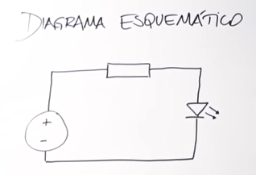
<br>
</div>

<br>

- 🔍 **Identificação de Componentes:** Conhecer os símbolos e funções dos componentes é vital para a montagem de circuitos, promovendo um entendimento mais profundo da eletrônica.
<div align="center">
<sub>Fontes:</sub>
<br>
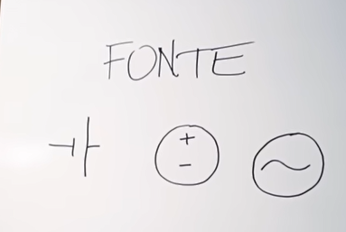
<br>
</div>

- 1º: Pilha ou bateria
  - Polo negativo: traço pequeno
  - Polo positivo: traço grande
- 2º: Fonte transformadora
  - COrrente alternada -> corrente contínua
- 3º: Fonte de corrente alternada
  - O `~` representa a corrente alternada

<br>

<div align="center">
<sub>Resistores:</sub>
<br>
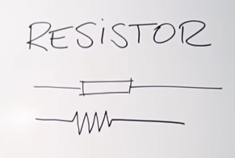
<br>
</div>

- Controla a corrente elétrica
- Aplicativo `Resistor Code Calculator` ajuda a ver qual é a resistência
- Faixa prateada/dourada na extremidade da **direita**
- Resistores com variação de resistências...

<div align="center">
<sub>Potenciômetros!</sub>
<br>
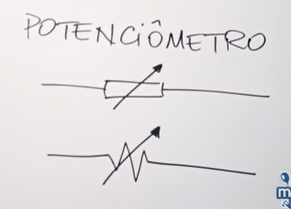
<br>
</div>
- Pista de grafite que alterna a resistência conforme a distância da "flechinha"

<div align="center">
<sub>Capacitores:</sub>
<br>
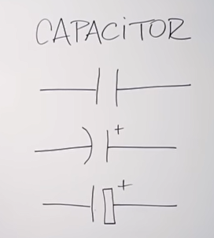
<br>
</div>

- 1º: Capacitor sem polaridade
- 2º e 3º: Capacitores polarizados
- Capacitância do capacitor: quanto de energia ele consegue armazenar. Medido em Farad(F).
- Voltagem máxima escrita no capacitor (ex. do vídeo: 25V), se ultrapassar disso, explode.

<div align="center">
<sub>Relé:</sub>
<br>
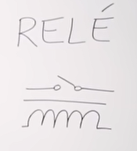
<br>
</div>

- Dispositivo eletromecânico/eletrônico -> Interruptor remoto que liga/desliga um circuito elétrico de alta potência/corrente isolando o circuito de controle do circuito controlado.
- É possível tornar componentes de corrente contínua e corrente alternada compatíveis.

##### Semicondutores

- Feitos com materiais tipo o Silício -> Entre os condutores e os isolantes
<div align="center">
<sub>Diodo:</sub>
<br>
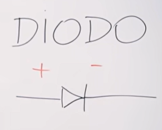
<br>
</div>

- A corrente elétrica vai de um lado, mas não volta pelo sentido contrário
- Pode proteger o circuito de dissipação de energias desnecessárias

<div align="center">
<sub>Light Emitting Diode (Diodo emissor de luz):</sub>
<br>
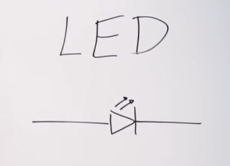
<br>
</div>

- Para identificar o polo negativo/positivo do led depois das "perninhas cortadas" é só utilizar um multímetro
- É também possível identificar o polo positivo de um led vendo a "chapa" dentro do led. Ela é assimétrica e o lado menor sempre será o polo positivo

<div align="center">
<sub>Transistor:</sub>
<br>
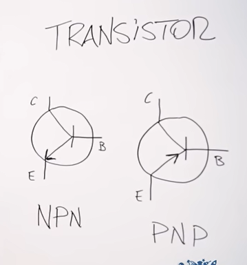
<br>
</div>

- Três pernas:
  - Coletor (Para a corrente fluir)
  - Emissor (Para a corrente fluir)
  - Controle (Base) -> Dependendo da corrente colocada na base, a corrente que passa nos dois supracitados pode ser controlada.
- Interruptor eletrônico, tipo um relé mas sem partes mecânicas, menor, mais durável, mais rápido e mais confiável
- NPN e PNP indicam o sentido da corrente elétrica, mas depende da composição química deles que é um pouco mais complexa

<br>

#### **Pode resistor no negativo do LED?**

💡 Resistor no terminal negativo é válido.
🔌 A corrente elétrica é o que deve ser controlado.
⚡ Tensão não é o mesmo que corrente.
🔄 Troca de posição do resistor não altera o funcionamento.
🔥 LED pode queimar sem resistor.

##### Considerações

⚙️ **Função do Resistor:** O resistor tem a função específica de limitar a corrente no circuito, protegendo o LED de danos. Sem ele, a corrente excessiva pode levar à queima do LED.
🔍 **Corrente vs. Tensão:** É essencial distinguir entre corrente (medida em amperes) e tensão (medida em volts). A tensão é a diferença de elétrons entre os terminais, enquanto a corrente é o fluxo desses elétrons.
🔄 **Posição do Resistor:** A posição do resistor (positivo ou negativo) não impacta o funcionamento do circuito, pois ele reduz a corrente independentemente de onde esteja.
💧 **Analogias com Água:** Comparar corrente elétrica com fluxo de água ajuda a entender que, ao restringir a passagem em um ponto do circuito, a corrente é reduzida por todo o circuito.
🔥 **Riscos de Não Usar Resistor:** Testes demonstram que conectar um LED sem resistor pode resultar em danos imediatos ao componente, evidenciando a importância do resistor na proteção do circuito.
🛠️ **Importância da Prática:** A abordagem prática utilizada no vídeo ajuda a solidificar a compreensão dos conceitos teóricos, tornando o aprendizado mais eficaz.
📊 **Educação em Eletrônica:** A clareza em conceitos como corrente e tensão é fundamental para quem deseja trabalhar com eletrônica, como em projetos envolvendo Arduino.

<div align="center">
<sub>Como identificar a resistência dos resistores:</sub>
<br>
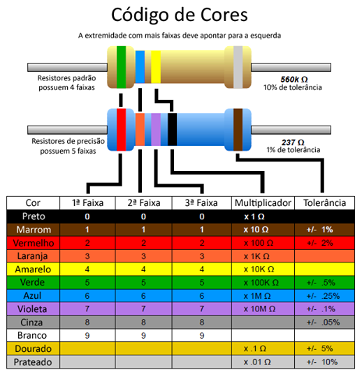
<br>
</div>

<br>

#### **Como usar a Protoboard**

- É utilizada para montar o circuito sem precisar soldar as coisas direto na placa
- Jumpers são utilizados para conectar na protoboard
- É possível também comprar fios sólidos de 3mm/22awg e descascar poucos milímetros de cada ponta com um alicate de bico redondo longo, assim não fica um emaranhado de fios
- O "rasgo" no meio da Protoboard serve para encaixar "chips" que se chamam Circuito Integrado ou CI, em que cada "perninha" (cuja nomenclatura correta é terminal) encaixa em cada furo da protoboard

<br>

#### **Tinkercad:**

(Não fiz, é bem intuitivo)

<br>

#### **Fundamentos da linguagem C/C++:**

Livro: C++ Programming

##### Capítulo 2 - 1.1 Organização de arquivos
- **Divisão de Arquivos**: Separar código em arquivos de cabeçalho (".h") e implementação (".cpp") para organizar declarações e definições.
  - *Exemplo*: Em um projeto de jogo, `player.h` contém as declarações da classe `Player`, e `player.cpp` contém a implementação dos métodos dessa classe.
  
- **Modularidade**: Facilita a reutilização de código e simplifica a depuração em projetos maiores.
  - *Exemplo*: Um módulo de cálculos matemáticos pode ser reutilizado em diferentes partes do projeto sem precisar duplicar o código.
  
- **Guarda de Inclusão**: Evita múltiplas inclusões do mesmo arquivo de cabeçalho.
  - *Exemplo*: O arquivo `math.h` utiliza `#ifndef MATH_H` e `#define MATH_H` para prevenir inclusão múltipla.

- **Compilação Incremental**: Arquivos objeto permitem compilar partes do código separadamente.
  - *Exemplo*: Alterar `player.cpp` em um grande projeto compila apenas o arquivo modificado, economizando tempo.

- **Makefiles**: Automatizam a compilação em projetos com vários arquivos.
  - *Exemplo*: O Makefile define como compilar o projeto automaticamente com `g++ main.cpp player.cpp -o game`.

##### Capítulo 2 - 1.2 Instruções
- **Instruções**: São comandos que terminam com ponto e vírgula, como `cout << "Olá!"`.
  - *Exemplo*: `int x = 5;` é uma instrução simples que inicializa a variável `x`.

- **Instruções Compostas**: Agrupam várias instruções com `{}`, usadas em loops e condicionais.
  - *Exemplo*: Dentro de um `if`, `{ int x = 10; cout << x; }` agrupa instruções que serão executadas quando a condição for verdadeira.

- **Execução Sequencial**: Instruções são executadas de cima para baixo, a menos que controladas por estruturas como loops.
  - *Exemplo*: `cout << "Começo"; cout << "Fim";` imprime "Começo" seguido de "Fim".

- **Fluxo de Controle**: Redireciona a execução do código com base em condições.
  - *Exemplo*: `if (idade >= 18) { cout << "Maior de idade"; } else { cout << "Menor de idade"; }` altera a saída com base no valor de `idade`.

##### Capítulo 2 - 1.5 Escopo e namespaces
- **Escopo Global**: Elementos declarados no escopo global são visíveis em todo o programa.
  - *Exemplo*: `int x = 5;` no escopo global permite que qualquer função acesse e modifique `x`.

- **Escopo Local**: Variáveis declaradas dentro de funções ou blocos têm um escopo local.
  - *Exemplo*: `int main() { int y = 10; }` cria uma variável `y` que só pode ser usada dentro da função `main`.

- **Namespaces**: Criam escopos separados para evitar conflitos de nomes.
  - *Exemplo*: `namespace Math { int soma(int a, int b) { return a + b; } }` permite que a função `soma` seja referenciada como `Math::soma()`.

- **Guarda de Nomes**: Uso adequado de namespace para evitar colisões de nomes.
  - *Exemplo*: `using namespace std;` evita a necessidade de usar `std::` antes de comandos como `cout`.

##### Capítulo 2 - 3.1 Tipo
- **Tipos Primitivos**: Como `int`, `char`, `float` e `bool`, usados para armazenar valores simples.
  - *Exemplo*: `int idade = 20;` armazena a idade como um valor inteiro.

- **Segurança de Tipo**: O sistema de tipos previne operações inválidas.
  - *Exemplo*: `int x = "texto";` resulta em erro, pois o compilador não permite atribuir uma string a um inteiro.

- **Otimização**: Tipos ajudam o compilador a otimizar o uso de memória.
  - *Exemplo*: Usar `char` ao invés de `int` para armazenar caracteres economiza memória.

- **Abstração**: Tipos permitem que programadores trabalhem em um nível mais alto, abstraindo detalhes de implementação.
  - *Exemplo*: `float altura = 1.75;` representa um número decimal de maneira simples sem se preocupar com os detalhes de armazenamento.

- **Modificadores**: `const`, `volatile` e outros alteram o comportamento dos tipos.
  - *Exemplo*: `const int max = 100;` define um valor constante que não pode ser modificado.

##### Capítulo 2 - 4.1 Operadores lógicos
- **and (&&)**: Verifica se ambas as condições são verdadeiras.
  - *Exemplo*: `if (x > 0 && y > 0)` verifica se `x` e `y` são maiores que zero.

- **or (||)**: Verifica se ao menos uma das condições é verdadeira.
  - *Exemplo*: `if (x > 0 || y > 0)` verifica se `x` ou `y` são maiores que zero.

- **not (!)**: Inverte o valor lógico da condição.
  - *Exemplo*: `if (!chove)` é verdadeiro quando `chove` é falso.

##### Capítulo 2 - 6 Fluxo de controle
- **Condicionais**: Usam estruturas como `if`, `else if`, e `switch` para tomar decisões com base em condições.
  - *Exemplo*: `if (idade >= 18) { cout << "Maior de idade"; } else { cout << "Menor de idade"; }`.

- **Loops (iterações)**: Estruturas como `while`, `do-while`, e `for` repetem blocos de código até que uma condição seja atendida.
  - *Exemplo*: `for (int i = 0; i < 10; i++) { cout << i; }` imprime os números de 0 a 9.

- **break e continue**: `break` encerra um loop, e `continue` pula para a próxima iteração.
  - *Exemplo*: `for (int i = 0; i < 10; i++) { if (i == 5) break; }` encerra o loop quando `i` é igual a 5.

- **goto**: Evita-se o uso por tornar o código confuso.
  - *Exemplo*: `goto label;` redireciona a execução para a linha marcada com `label:`.

<br>

#### **Pisca LED**

- 💡 O projeto consiste em fazer um LED piscar em intervalos.
- 🔌 Precisamos de uma placa Arduino Uno, cabo USB, LED, resistor, protoboard e fios Jumper.
- ⚙️ Conectamos o Arduino à protoboard e ao LED 1. Jumper preto no pino GND e conectar na Protoboard (canto inferior esquerdo perto do "+") 2. Jumper vermelho no pino 10 e na Protoboard contar 6 "furinhos" e conectar 3. A perna menor do LED alinhada com o preto (GND) 4. Colocar o resistor alinhado ao jumper vermelho e a outra ponta alinhada com a perna maior do LED
<div align="center">
<sub>Esquema final:</sub>
<br>
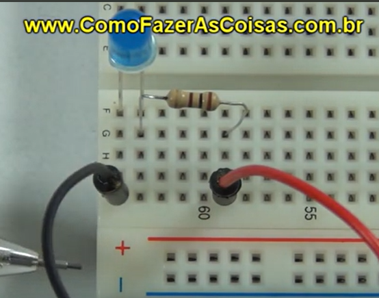
<br>
</div>
- 💻 Utilizaremos a IDE do Arduino para programar o LED.
  - 📝 O código inclui métodos setup e loop para controlar o LED.

```
// executado ao programa iniciar. Configurações utilizadas no projeto
void setup () {
    pinMode(10, OUTPUT); // Se referencia ao pino 10, output será um pino de saída
}

// Ficará rodando continuamente
void loop() {
    digitalWrite(10, HIGH); // Vai mandar energia para a porta 10
    delay(1000); // Espera 1000 ms
    digitalWrite(10, LOW); // Vai tirar a energia da porta 10
    delay(1000);
}
```

- 🚀 Pronto! O LED começa a piscar em intervalos de um segundo.

##### Considerações

- 🔗 O uso de protoboard facilita a montagem de circuitos, permitindo testar conexões sem soldagem, o que é ideal para iniciantes.
- 📜 A programação em C na IDE do Arduino é intuitiva, com comentários que ajudam a entender o funcionamento do código.
- 🔄 O método loop é fundamental, pois controla a execução contínua das funções, permitindo que o LED pisque indefinidamente.
- ✅ A verificação e compilação do código são etapas cruciais para garantir que o programa funcione corretamente antes de carregar no Arduino.
- 📶 A conexão com o computador e o upload do código são simples, tornando o processo acessível para todos.

<br>

---

<br>

### <a name="1-instrucao"></a> Aula 1 - Programação em Arduino e Eletrônica Básica - Instrução

`Escrever conteúdo de amanhã aqui`

<br>

---

<br>

### <a name="1-ponderada"></a> Aula 1 - Programação em Arduino e Eletrônica Básica - Ponderada
